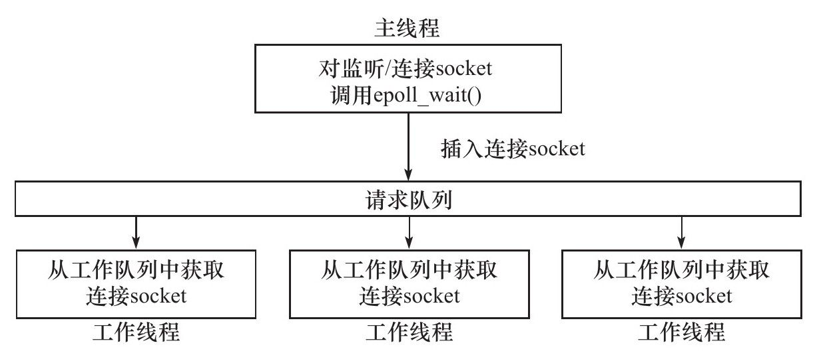

# 半同步/半反应堆线程池

使用一个工作队列完全解除了主线程和工作线程的耦合关系：主线程往工作队列中插入任务，工作线程通过竞争来取得任务并执行它。不过，如果要将该线程池应用到实际服务器程序中，那么我们必须保证所有客户请求都是无状态的，因为同一个连接上的不同请求可能会由不同的线程处理

## 功能说明

* 同步I/O模拟Proactor模式
* 半同步/半反应堆
* 线程池

工作原理示意图

书中原文
> 异步线程只有一个，由主线程来充当。它负责监听所有socket上的事件。如果监听socket上有可读事件发生，即有新的连接请求到来，主线程就接受之以得到新的连接socket，然后往epoll内核事件表中注册该socket上的读写事件。如果连接socket上有读写事件发生，即有新的客户请求到来或有数据要发送至客户端，主线程就将该连接socket插入请求队列中。所有工作线程都睡眠在请求队列上，当有任务
到来时，它们将通过竞争（比如申请互斥锁）获得任务的接管权。这种竞争机制使得只有空闲的工作线程才有机会来处理新任务，这是很
合理的。

> 主线程插入请求队列中的任务是就绪的连接socket。这说明该图所示的半同步/半反应堆模式采用的事件处理模式是Reactor模式：它要求工作线程自己从socket上读取客户请求和往socket写入服务器应答。这就是该模式的名称中“half-reactive”的含义。实际上，半同
步/半反应堆模式也可以使用模拟的Proactor事件处理模式，即由主线程来完成数据的读写。在这种情况下，主线程一般会将应用程序数据、任务类型等信息封装为一个任务对象，然后将其（或者指向该任务对象的一个指针）插入请求队列。工作线程从请求队列中取得任务对象之后，即可直接处理之，而无须执行读写操作了。

> 半同步/半反应堆模式存在如下缺点：
> * 主线程和工作线程共享请求队列。主线程往请求队列中添加任务，或者工作线程从请求队列中取出任务，都需要对请求队列加锁保
护，从而白白耗费CPU时间。
> * 每个工作线程在同一时间只能处理一个客户请求。如果客户数量较多，而工作线程较少，则请求队列中将堆积很多任务对象，客户
端的响应速度将越来越慢。如果通过增加工作线程来解决这一问题，则工作线程的切换也将耗费大量CPU时间。
